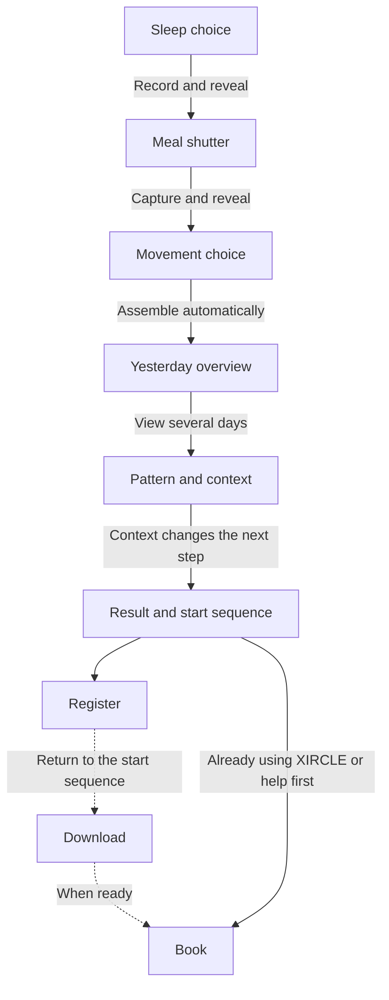

# XIRCLE V2 — Proposed Experience

**Status:** Proposal for review. Planning only; no product implementation.
**Date:** 7 September 2026
**Branch:** `feat/xircle-experience-v2`
**Inspected repository:** `TeemClover/Teem`, main at `8f0d7e6aa71ba21a4a7b92f443952394a1ad0ee6`
**Brief:** `XIRCLE_V2_ASTRA_HIGH_KICKOFF_2026-09-07.md`, read in full from the supplied attachment.

## 1. Recommendation

Build **“หนึ่งวัน เห็นด้วยกัน” — One Day, Seen Together**.

Keep the pleasure of collecting sleep, capturing a meal, recording movement, and seeing yesterday assemble. Compress it into one continuous visual object. Then expand that same object into several days and let **a change in everyday context change the next step Teem + Ako suggest**.

The visitor should leave with this belief:

> **“ถ้ามีข้อมูลของตัวเองจริง ๆ เราคงคุยกันได้ตรงเรื่องกว่านี้”**

Recommend **six meaningful beats, five required demo taps, approximately 40–55 seconds to the conversion state**. These are design targets to validate, not measured completion times. The five taps are sleep choice, food shutter, movement choice, reveal several days, and context choice. There is no separate Start screen, confirmation after a simple choice, or Next after the shutter.

The main persuasion change is substantial: the existing journey teaches an ecosystem and sends the visitor to another lesson. V2 should finish its explanation on `/xircle/`, demonstrate the human contribution there, and offer **Register → Download → Book** there.

Three firm decisions:

1. **The record persists while the question changes.** Choices must alter visible evidence, rather than merely unlock a button beside an unchanged poster.
2. **Teem + Ako enter before the CTA.** Their contribution is demonstrated through a worked example, not a biography or an unexplained “Human Care” destination.
3. **Keep the Habit Score composition idea; remove the invented calculation.** Current store evidence verifies sleep and activity well, but does not establish the older demo’s exact Eat/Move/Sleep score or photo-analysis behavior. The recommended base experience uses an unscored day overview, with the precise Habit Score presentation contingent on current-build verification. Section 7 makes that decision explicit.

## 2. What was actually inspected

### Repository and live coverage

The live `/xircle/` HTML was byte-for-byte identical to the inspected repository file. The source baseline is therefore tied to the served entry page, rather than an old checkout. Relevant runtime, styles, assets, navigation state, and booking code were inspected directly.

| Surface | Inspection | Material finding |
| --- | --- | --- |
| `/xircle/` | Walked all ten entry scenes in the live desktop browser; inspected HTML, runtime, loaded CSS and direct artwork | Strong one-day idea; 15 taps to its final scene, 16 including the Human Care exit; no registration, download, booking, or named Teem + Ako payoff in the entry |
| Entry dependencies | `xircle/index.html`, `_shared/story-v6.js`, `_shared/state.js`, `_shared/analytics.js`, typography and the complete loaded CSS dependency chain | Entry shares behavior with other journeys; state can redirect returning visitors; scene analytics do not all reach the adapter |
| Direct artwork | Viewed the live hero and local food, next-day and app-device artwork; inspected image dimensions and byte sizes | Attractive atmosphere, but baked numbers and ecosystem labels can conflict with the interactive UI or imply unverified features |
| `/meet/` | Inspected live neutral and health states, opened the health booking dialog, read `meet.js` and inline behavior in `index.html` | Teem = systems/people; Ako = food/routine/real life. Health entry emphasizes Body Check-in. Booking is a request awaiting confirmation |
| `/meet/?intent=health` | Opened a fresh live tab and checked the health control; searched both page scripts for query handling | **Not supported today.** Health remained unselected. A health topic exists, but a health query handoff does not |
| `/invite` | Read source; followed the live redirect and opened the public signup form | Immediate redirect to the specified referral site; catalog first, signup form second; not an on-site conversion bridge |
| CloverX public site | Read current `/th` and `/th/xircle`; inspected the latter’s live download section | Official product reference, but its app section still says “เร็วๆ นี้” and displays non-link store placeholders |
| Apple App Store | Located through Apple’s official catalog, then opened the actual Thai storefront and inspected screenshots/description | Correct app is **XIRCLE**, ID **6785562482**, bundle **health.xircle.app**, seller **CLOVERX (THAILAND) COMPANY LIMITED** |
| Google Play | Read indexed listing and live listing; inspected current screenshot gallery | Correct package **health.xircle.app**, developer **Clover X**; live listing was newer than indexed text |

The browser walkthrough used a desktop viewport. Mobile constraints were inspected in source; this pass did **not** constitute a physical iPhone/Android or mobile-browser acceptance test. No account was created, credentials entered, app installed, or booking request submitted. Authenticated registration completion, native onboarding and automatic data sharing with an advisor remain unverified.

### Verified destinations and source freshness

| Purpose | Destination | Current evidence and consequence |
| --- | --- | --- |
| Demo | [myClover XIRCLE](https://www.myclover.com/xircle/) | Canonical direct-sales URL; must remain directly accessible on every visit |
| Registration entry | [myClover invite](https://www.myclover.com/invite) | HTML meta refresh plus `window.location.replace`; no return handling |
| Referral destination | [XIRCLE referral registration](https://register.xircle.health/?ref=O5F3LN) | Opens a catalog with a “สมัครสมาชิก XIRCLE” button. That button navigated to `/buyer`, with `O5F3LN` already populated |
| iOS | [XIRCLE on the Thai App Store](https://apps.apple.com/th/app/xircle/id6785562482?uo=4) | Version **1.0.6**; Apple catalog release timestamp **2026-09-05T20:25:50Z**; requires **iOS 15.1+**. This is not the unrelated “Xircle - Create Social Circles” app |
| Android | [XIRCLE on Google Play](https://play.google.com/store/apps/details?hl=en&id=health.xircle.app) | Live page says updated **4 September 2026**. Search-index text said 23 August; use the live observation for freshness |
| Booking | [myClover Session](https://www.myclover.com/meet/) | First session advertised as free; online 25 minutes / in person 45 minutes; time confirmed after a request |
| Official background | [CloverX](https://www.cloverx.co.th/th), [official XIRCLE page](https://www.cloverx.co.th/th/xircle) | Product details and company reference, not a download destination |

Registration detail worth preserving in the handoff specification: the form displayed **นรินทร์ ลีลาภรณ์** for the supplied referral code and stated the referring relationship cannot be changed after successful registration. Keep the supplied code unchanged. Reconcile that displayed name with public Teem + Ako wording before promising a particular account/advisor association. A referral link is not evidence that Teem + Ako automatically receive someone’s health records.

## 3. Diagnosis of the current experience

### The good work to keep

- **“เมื่อวานคุณดูแลตัวเองยังไง?”** is personal, comprehensible and more interesting than “a smart health platform.” Keep it.
- **Sleep, movement and food** are recognizable parts of a day. They make the topic approachable without requiring familiarity with HRV or recovery metrics.
- **The shutter has meaning.** It turns something fleeting into a record. This is the strongest reason to retain a camera-like interaction.
- **The next morning is a payoff.** The day becoming visible is a useful transformation, not simply decorative animation.
- **Three things becoming one picture** is strong visual communication. Preserve the core of the Habit Score composition without treating a demo formula as product truth.
- **“วันนี้เลือกแค่ 1 อย่าง”** is a useful conclusion. Put it after the context demonstration, where the choice becomes better informed.
- The existing source keeps health-like selections in memory and has defensive storage handling. Preserve that restraint in the new entry.
- The self-hosted Thai fonts and attempts to keep controls immediately operable are useful foundations.

### Where the current route loses a stranger

| Current step | What happens now | Recommendation |
| --- | --- | --- |
| S0: hook | Start button plus “ประมาณ 2 นาที” | Merge the hook with the first sleep choice. Show a sub-minute demo promise only after testing it |
| S1: memory question | Choose Eat/Move/Sleep; receive the same generic feedback; press Next | Remove this separate screen. It asks which factor mattered most without evidence, and its choice does not materially affect the day |
| S2: sleep | Choose a qualitative answer; fill a meter; enable Next | Choice immediately resolves a prepared sample record and reveals the food prompt; keep the record visible |
| S3: food | Choose meal type; press shutter; wait; press another Next | Start with a framed example meal. Shutter records it and advances. Mandatory meal classification and post-capture Next are unnecessary |
| S4: movement | Choose; reveal copy; press “จบวันนี้” | Choice records movement and triggers the day-to-morning transformation |
| S6: Habit Score | Produce a numeric score from hardcoded category values; show a second illustration with baked metrics | Keep the assembly, eliminate competing sources of numbers, and use the score policy in Section 7 |
| S7: choose one adjustment | Choose Eat/Move/Sleep before learning the person’s context; press Next | Move this payoff after Teem + Ako’s worked example. Give one contextual next step rather than another category picker |
| S8: implementation difficulty | Read that knowledge does not guarantee consistency; press Next | Demonstrate that problem through a context choice instead of asserting it on a separate screen |
| S9: ecosystem | Read XIRCLE, X-VISOR, RoutineX and White Cat roles; press Next | Remove from the acquisition path. Keep the useful loop as actions the visitor just saw |
| S10: exit | Go to Human Care, then more education | End with a real-world start sequence, with named people and verified links |

The current default path has **five avoidable confirmation/navigation taps attached to actions**: after memory, sleep, food capture, movement and adjustment selection. Merely deleting those buttons is insufficient: S8–S10 still postpone the human value and conversion.

### Specific trust, speed and continuity issues

1. **The memory comparison does not actually demonstrate a difference.** It largely turns subjective answers into another visual representation. V2 must visibly distinguish a remembered description from a recorded time, count or image.
2. **“เมื่อวานไม่ต้องเดาแล้ว” overstates what the demo knows.** The website has not measured yesterday. Keep the invitation personal, but label the entire constructed day as an example.
3. **The score is a local illustration.** `buildScore()` assigns category values and averages them. For the inspected balanced meal / some walking / middling sleep path, the UI showed 82%, 61%, 62%, then 68. No verified production formula supports that calculation.
4. **Artwork is a second, inconsistent dashboard.** `xircle-s06-yesterday-visible.webp` contains fixed food macros, 7,842 steps and 7h32m sleep regardless of the visitor’s choices. Do not put these beside different live values. Food art also contains an implied ingredient breakdown that a caption alone cannot fully neutralize.
5. **The human explanation is abstract and late.** Neither Teem nor Ako is named in the entry. “Human Care” names a category of service without demonstrating why these two people help.
6. **The app is no longer hypothetical.** Yet the entry offers a route through an ecosystem instead of getting the person to the actual app and a session.
7. **The route is not reliably replayable.** After reaching S10, reopening `/xircle/` in a new tab redirected to `/xircle/care/`. `state.js` enforces the next legacy milestone based on existing local progress. That undermines Teem’s ability to send one reliable demo URL.
8. **The weight is front-loaded.** `loadArt()` assigns all ten scene image sources at boot: **4,659,040 image bytes**, before transfer compression/caching effects. These are requested eagerly even though only the first scene is needed. Nine CSS files are loaded through direct links and imports, totaling about 69.6 KB of source.
9. **Transitions add delay without new information.** Ordinary scene changes include a 620 ms hold followed by a 390 ms exit animation, before additional entrance sequencing. Across nine scene changes, this alone adds roughly nine seconds. The food capture also waits 980 ms.
10. **Mobile legibility is being traded for fixed geometry.** The route tune uses clipped reveal regions, 42 px choice minimums and approximately 9–9.5 px Habit Score explanation/legend text. These are source-level risks, not a claim that every phone currently clips.
11. **The sharing surface is under-specified.** The entry has no dedicated Open Graph/Twitter preview and its description sells the longer ecosystem. Its restrictive robots policy should not be casually removed as part of this redesign.
12. **There is no measured drop-off baseline in this inspection.** The analytics adapter rejects `xircle_scene_view`, and the flags default to console analytics. Diagnosis here is based on observed behavior and source, not invented abandonment percentages.

### Copy decisions

| Current copy | Decision | Proposed treatment |
| --- | --- | --- |
| เมื่อวานคุณดูแลตัวเองยังไง? | Keep | Opening hook |
| รู้จริง — หรือแค่จำได้? | Change | Show a remembered phrase resolving into recorded detail; avoid making the visitor feel tested |
| ความจำเก็บได้ไม่ครบทุกชิ้น | Keep the idea | Express through missing-to-visible pieces, not a separate lecture |
| ยังไม่ต้องตีความ แค่เก็บสิ่งที่เกิดขึ้นไว้ก่อน | Compress | Small “เก็บไว้ก่อน” response where needed |
| หนึ่งวันยังไม่ใช่ Pattern | Keep the meaning | “วันเดียวเห็นเหตุการณ์ หลายวันเริ่มเห็นแนวโน้ม” at the range change |
| วันนี้เลือกแค่ 1 อย่าง | Keep | Payoff after context |
| ข้อมูลบอกว่าอะไรเปลี่ยน แต่ชีวิตจริงบอกว่าเพราะอะไร | Change | “ข้อมูลช่วยให้เห็นสิ่งที่เปลี่ยน บริบทช่วยให้เลือกว่าจะลองอะไรต่อ” — context supports interpretation; it does not prove causation |
| ไป Human Care | Remove from primary journey | “นัดดูข้อมูลกับทีม + เอโกะ” at the end |
| XIRCLE → X-VISOR → RoutineX → สมุดแมวขาว | Remove from primary journey | The useful sequence becomes “เก็บ → ดูด้วยกัน → ลองหนึ่งอย่าง → กลับมาดู” |

## 4. Persuasion architecture

The app already makes information easier to understand. Do not weaken the app’s value by pretending it only supplies incomprehensible numbers, or imply an advisor is mandatory to use it.

| Belief to create | Evidence the visitor experiences | What that earns |
| --- | --- | --- |
| “I can describe yesterday, but a description leaves things out.” | A qualitative sleep description becomes a timed sample record | Permission to introduce recorded data |
| “Keeping the pieces changes what I can see.” | Sleep, a meal image and movement persist on the same day | XIRCLE’s usefulness as a place to review records |
| “A day and a pattern are different.” | Yesterday expands into seven days; repeated timing changes become visible | A reason to collect data over time |
| “A pattern still needs my life around it.” | The same chart supports different next steps when context changes | The need for a conversation, without manufacturing alarm |
| “Teem + Ako help me choose something workable.” | Teem identifies a comparison; Ako turns the context into one feasible experiment | Named human value |
| “I want to try this with my own records.” | A provisional action and an open future review, not a fake improved score | Register, download, then book |

**The demonstration should sell a better conversation, not a diagnosis, a guaranteed outcome or dependency on a coach.** The visitor stays in control of what they share and what they try.

The loop is visible in the persistent object: a record enters the day, several days expose a pattern, a context note is attached, one experiment is chosen, and future days remain open for review. It does not require a separate five-item product diagram.

### What belongs on CloverX instead

Detailed Band/Scale specifications, current prices and bundles, supplement information, company history, full product claims, support documentation and long FAQs should remain on the official site. One quiet final link is enough: **“ข้อมูลผลิตภัณฑ์จาก CloverX”**.

Do not place RoutineX, a device catalog, business opportunity, certification, MaxAge/Bio Age, or another app/community signup between this demo and the three intended next steps.

## 5. Alternative concepts

| Concept | Core experience | Strength | Weakness / risk | Decision |
| --- | --- | --- | --- | --- |
| **A. หนึ่งวัน เห็นด้วยกัน** | Assemble one day; expand its history; add context; see a different next step | Preserves the best existing tactile interactions while earning the human layer | Requires disciplined sample-data labeling and a coherent fixture | **Recommended** |
| **B. สองชีวิต ข้อมูลคล้ายกัน** | Toggle between two people with similar recorded patterns; reveal why different contexts suggest different actions | Fastest and clearest human-value demonstration; around 25–40 seconds as a hypothesis | Less ownership through doing; weaker food/day-assembly payoff; must not imply matched readings establish a medical comparison | Good alternative if a shorter campaign variant is later needed |
| **C. เอาคำถามมาวางบนโต๊ะ** | Pick a question; watch a sample record and two annotations assemble into a conversation plan | Strong direct-sales and booking tool; people are present from the first action | Can resemble a scripted consultation or chat intake; explains the service more than the app; highest risk of feeling like a lead form | Use only if the primary objective changes to booking first |

Choose A because a stranger must understand **both** why the record is worth keeping and why discussing it with Teem + Ako helps. B is a sharper argument for human interpretation but gives up the current experience’s most memorable action. C asks for interest before earning it.

Do not run three launch variants simultaneously. Establish one comprehensible experience before optimizing variants.

## 6. Recommended experience: exact beats and taps

### Shared visual object and global behavior

The central object is **one day record**, not a succession of large promotional posters. It has three persistent places: sleep, food and movement. Each action fills one place. The day later becomes the most recent column in the history view, and the selected context attaches to those same dates.

Global visible labels:

- Brand: **XIRCLE · ทีม + เอโกะ**
- Sample badge throughout the demo: **ข้อมูลตัวอย่าง ไม่ใช่ค่าของคุณ**
- Initial duration caption: **ประมาณ 45 วินาที · ไม่ต้องสมัคร** — revise if testing does not support it.
- Quiet navigation: **ย้อนกลับ** when relevant; **เริ่มใหม่** after the overview. Neither is required to finish.

The opening choices explicitly say **“เลือกคืนตัวอย่าง”**. They choose a prepared fictional record; they are not a disguised health questionnaire. Never take a visitor’s statement about their actual sleep and present invented measurements as its correction.

### Beat 1 — A remembered description becomes a record

**Target elapsed time:** 0–7 seconds. **Required tap 1.**

**Public copy**

> เมื่อวานคุณ
> ดูแลตัวเองยังไง?
>
> ลองต่อวันตัวอย่าง แล้วดูว่าข้อมูลจริงช่วยให้คุยเรื่องของคุณได้แค่ไหน
>
> เริ่มจากการนอน · เลือกคืนตัวอย่าง

Choices: **นอนน้อย / พอใช้ / เต็มที่**. Retain these familiar controls, clearly within the fictional example.

**Before the tap:** one quiet, partly drawn day; the sleep slot carries a quotation mark and an unresolved time. Food and movement are visible as empty places, so the visitor understands the scope without reading instructions.

**Immediately after the tap:** the pressed state appears within 100 ms. The chosen phrase shrinks into a small “คำอธิบาย” label; a prepared sleep duration and timeline resolve beside it under “บันทึกจากอุปกรณ์ · ตัวอย่าง”. The sleep piece settles into the day in about 250–350 ms, and the food prompt becomes actionable. The duration remains visible, so reading is not dependent on catching a disappearing animation.

**Response copy:** **“เห็นเวลาที่นอน มากกว่าคำว่า ‘พอใช้’”** for the middle example; use the selected phrase for the other cases.

**The meaning:** recorded details can support a more specific conversation than a broad description. This is not proof that a wearable is infallible or that the visitor remembered incorrectly.

### Beat 2 — Capture a meal, keep context

**Target elapsed time:** 7–13 seconds. **Required tap 2.**

**Public copy**

> มื้อนี้
> เก็บไว้กลับมาดู
>
> ภาพหนึ่งมื้อ ช่วยเติมเรื่องที่ตัวเลขเล่าไม่หมด

Button: **ถ่ายมื้อตัวอย่าง**.

Supporting caption: **กล้องจำลอง · ภาพตัวอย่าง**.

**Before the tap:** a food-only crop is already framed in a camera view. Sleep remains recorded above or beside it. The shutter is enabled immediately. There is no “เลือกมื้อก่อน” lock and no request for camera permission.

**Immediately after the tap:** brief, soft shutter feedback; the frame becomes a timestamped thumbnail marked **“เก็บภาพมื้อ 12:30 แล้ว”**. That thumbnail moves into the food slot, and the movement prompt is revealed within roughly 300 ms. No scan line, pretend nutrient processing, upload spinner, calorie estimate or post-shutter Next.

**The meaning:** food/context can be recorded and revisited instead of reconstructed later. The interaction is an illustrative logging moment. The official site supports food logging conceptually; the current native camera workflow was not verified. Do not label this UI a faithful reproduction of a shipped app screen.

Mandatory meal-type selection is removed: it adds little once a useful sample is already framed. If a later version offers different example photos, selecting one must actually replace the photo; the subsequent shutter remains meaningful. Do not restore a three-level “good/medium/bad meal” scoring question.

### Beat 3 — Movement becomes visible across the day

**Target elapsed time:** 13–19 seconds. **Required tap 3.**

**Public copy**

> การขยับ
> ก็เป็นอีกชิ้นของวัน
>
> เลือกการขยับของวันตัวอย่าง

Choices: **นั่งเยอะ / มีเดินบ้าง / ตั้งใจขยับ**.

**Immediately after the tap:** a prepared step count and a small daytime distribution replace the vague description. The movement piece enters its place. The same complete day transitions to the next morning with a subtle light change; do not require “จบวันนี้”. Keep the count and food image visible throughout.

**Response copy:** **“เห็นทั้งจำนวนก้าว และช่วงที่ได้ขยับ”**.

**The meaning:** a total and its distribution are more concrete than “มีเดินบ้าง”. Do not declare someone sedentary, fit, metabolically healthy or in need of a product based on this selection.

### Beat 4 — The day assembles; the timeframe can expand

**Target elapsed time:** 19–27 seconds. **Required tap 4 opens the next beat.**

**Public copy**

> พอเก็บไว้
> เมื่อวานก็ชัดขึ้น
>
> การนอน การขยับ และมื้อที่บันทึก
> อยู่ในภาพเดียว

Primary action: **ดูต่อหลายวัน**.

**Visual payoff:** the three pieces compose around one center, using the existing Eat/Move/Sleep color memory and ring concept. The records remain legible as text. The base proposal labels this **“ภาพรวมวันตัวอย่าง”**; the center reads **“เมื่อวาน”**, not a fabricated 0–100 score. Completed arcs communicate that three records have arrived, not that the person achieved perfect health. No fourth Body Composition ring.

The score/presentation policy is in Section 7. If the current production Habit Score is verified, this is its earned position, with the name outside the center and only approved example values.

**After “ดูต่อหลายวัน”:** the day scales down into the final column of a seven-day display. A single day has become a comparison. This button is justified: it changes the question and time horizon; it does not confirm an answer already given.

**Transition copy:** **“วันเดียวเห็นเหตุการณ์ หลายวันเริ่มเห็นแนวโน้ม”**.

Do not time-dismiss this overview. A visitor may look at it, edit a piece, or expand the timeframe when ready.

### Beat 5 — Teem + Ako change what happens next

**Target elapsed time:** 27–44 seconds. **Required tap 5.**

**Public copy**

> ข้อมูลช่วยให้เห็นสิ่งที่เปลี่ยน
> แล้วชีวิตช่วงนั้นเป็นยังไง?

Small label: **ตัวอย่างวิธีคุยกับทีม + เอโกะ**.

**Visual:** retain the same records, now with a seven-day bedtime strip. Highlight the last three nights relative to the previous four. Show one relevant pattern, not a wall of HRV, RHR, stress, temperature and recovery cards. The meal thumbnail remains as an example of context that can be revisited, not evidence that lunch caused a sleep change.

Teem’s real portrait sits beside a short annotation anchored to the dates:

> **ทีม:** สามคืนหลังเริ่มนอนช้ากว่าสี่คืนแรก
> ลองดูว่าเกิดอะไรขึ้นช่วงนั้น

Ako’s real portrait accompanies the context question:

> **เอโกะ:** สามคืนนั้น มีอะไรต่างจากเดิม?

Prompt above the choices: **ลองเติมบริบทให้วันตัวอย่าง**.

Choices: **งานเลิกช้า / ต้องดูแลคนที่บ้าน / ยังไม่รู้**.

**Immediately after a context tap:** mark the selected dates with that note. **Do not change the underlying chart.** Replace the open question with a short Teem observation, an Ako response and one provisional experiment. Reveal the conversion area below the result without requiring another Next. Keep the result in view; do not move the person to a CTA before they can read it.

| Chosen example context | Teem’s contribution | Ako’s contribution | “วันนี้เลือกแค่ 1 อย่าง” | Review cue |
| --- | --- | --- | --- | --- |
| งานเลิกช้า | “ลองแยกดูคืนที่เลิกงานช้า กับคืนที่ไม่ดึก” | “ถ้าเวลาเลิกงานยังขยับไม่ได้ ลองเริ่มจากช่วงหลังเลิกงานที่พอจัดได้” | “กันเวลา 10 นาทีหลังเลิกงานไว้พัก ก่อนเริ่มกิจกรรมถัดไป” | “อีก 3 วัน ดูจังหวะการนอนกับโน้ตเรื่องงาน แล้วคุยกันว่าทำได้จริงไหม” |
| ต้องดูแลคนที่บ้าน | “ทำเครื่องหมายคืนที่ต้องดูแลคนที่บ้านไว้ก่อน” | “เริ่มจากช่วงพักที่พอเป็นไปได้ โดยไม่เพิ่มภาระอีกเรื่อง” | “เลือกช่วงพักที่คุณพอจัดได้หนึ่งช่วง” | “อีก 3 วัน ดูทั้งข้อมูลและเวลาที่พักได้จริง แล้วค่อยปรับให้เข้ากับบ้าน” |
| ยังไม่รู้ | “เห็นว่าเวลาเปลี่ยน แต่ยังไม่รู้ว่าเกี่ยวกับอะไร” | “ยังไม่ต้องรีบแก้ ลองเก็บเรื่องก่อนนอนเพิ่มอีกนิด” | “จดสั้น ๆ ว่าก่อนนอนทำอะไรอยู่ 3 คืน” | “เอาโน้ตมาดูคู่กับช่วงเวลานอน แล้วค่อยเลือกสิ่งที่จะลอง” |

These are **scripted examples of a conversation**, not personalized advice, messages from a live advisor, a clinical protocol or a promised three-day follow-up service. The three-day period is an illustrative review interval, not a medical threshold.

A visitor may tap another context to compare. The same numbers stay put and the proposed next step changes. That is the decisive proof of the human layer.

“ยังไม่รู้” is a full valid path. Its reward is a better question and a way to gather context, not an error state or a forced conclusion.

Show future days as empty/dashed places with **“กลับมาดูอีกครั้ง”**. Never animate a guaranteed improving health graph after an example action.

### Beat 6 — Start with real records

**Target elapsed time:** 44–55 seconds. **No additional demo tap required.**

**Public copy**

> ลองใช้ข้อมูลของคุณจริง ๆ
>
> XIRCLE ช่วยเก็บและสรุปข้อมูล
> ทีม + เอโกะช่วยดูต่อกับชีวิตจริง

Keep the worked example as a compact anchor. Add one small, current App Store screenshot as product proof, captioned **“หน้าจอจากแอป XIRCLE”** with its source. It is supporting evidence, not another tutorial or feature gallery.

The next-step area has three numbered rows, not three equal promotional cards:

| Row | Label and copy | Initial emphasis |
| --- | --- | --- |
| 1 | **สมัคร XIRCLE** — “ผ่านลิงก์แนะนำของเรา” | One dominant button linking directly to `/invite` |
| 2 | **ดาวน์โหลดแอป** — “เปิดแอป แล้วทำตามขั้นตอนเริ่มต้น” | Direct device-appropriate store link; no unverified account-linking promise |
| 3 | **นัดดูข้อมูลกับทีม + เอโกะ** — “มีข้อมูลแล้ว หรืออยากคุยเรื่องเริ่มต้น ก็นัดได้” | Lower-emphasis booking link, always usable |

Below the sequence: **“มีแอปแล้ว? นัดดูข้อมูลด้วยกันได้เลย”** linking directly to the same health booking handoff. No preliminary “I already have the app” questionnaire.

At the download row, include the material hardware expectation: **“ข้อมูลอัตโนมัติอย่างการนอนและการขยับ มาจากอุปกรณ์ที่รองรับ”**. Do not imply that installing the app alone produces wearable measurements. Link device details quietly to CloverX; do not insert a mandatory purchase funnel.

Before implementation, verify that the referral registration account can actually be used in the native app and whether any linking step is required. Keep the row-2 helper above until that path is verified. If the same account works directly, the helper can become **“ใช้บัญชีที่สมัครไว้”**. The neutral default supports the planned Register → Download order without assuming an integration.

Near booking only, use the already advertised service expectation: **“Session แรกไม่มีค่าใช้จ่าย · ยืนยันเวลาอีกครั้งก่อนนัด”**. Do not extend “free” to devices, all app capabilities or ongoing care.

Quiet footer: **“ข้อมูลผลิตภัณฑ์จาก CloverX”** and **“ตัวอย่างนี้ใช้เพื่ออธิบายการติดตามกิจวัตร ไม่ใช่การวินิจฉัยโรค”**. The sample badge remains visible; this footer is not a substitute for accurate visuals.

### Exact state flow

The diagram’s dashed links are user continuation, **not verified automatic callbacks**. Registration, installation and booking can take longer than one minute; the 30–60 second goal applies to understanding the proposition and reaching the next step.

## 7. Data and Habit Score policy

### Verified capabilities versus interpretation

| Item | Evidence | Proposal rule |
| --- | --- | --- |
| Sleep duration/stages and history | Current iOS and Android descriptions/screenshots | Core demo evidence; clearly fictional sample values |
| Sleep timing/consistency and multi-day comparisons | Explicit iOS description and current store screenshots | Use a simple timing comparison; do not promise identical presentation on both platforms |
| Steps/activity summaries | Both store descriptions | Core demo evidence |
| Heart metrics/recovery | Store descriptions | Real capabilities, but omit from the default minute because they increase interpretation burden |
| Food logging | Official CloverX XIRCLE page | Keep an illustrative capture moment; verify the native workflow before claiming exact UI parity |
| Scale/body composition | Official product page | Optional device reference; outside the default narrative and outside the three-ring composition |
| Exact current Habit Score, its formula and Eat/Move/Sleep weighting | Legacy repo/illustrations; not established by inspected current store descriptions/screenshots | Preserve the composition idea; do not ship the existing numeric formula as product truth |
| Automatic nutrient/macronutrient analysis from a photo | Not established by inspected current sources | Do not demonstrate or promise it |
| Automatic advisor access through referral | Not verified | Do not imply it; sharing is a separate, explicit user choice |
| Universal connection to arbitrary wearables/Apple Health/Health Connect | Not established in this inspection | Say “อุปกรณ์ที่รองรับ”; do not invent integrations |

Sources: [Apple listing](https://apps.apple.com/th/app/xircle/id6785562482?uo=4), [Google Play listing](https://play.google.com/store/apps/details?hl=en&id=health.xircle.app), [official XIRCLE product page](https://www.cloverx.co.th/th/xircle). These are developer/publisher descriptions, not independent validation of measurement accuracy or health outcomes.

### Preserve the Habit Score payoff responsibly

The good interaction is **three records becoming a coherent day**. The arbitrary score is not necessary for that moment to work.

**Recommended base for review:** three color-coded arcs, the actual example records, and “ภาพรวมวันตัวอย่าง”. No aggregate number, percentages, health grade or “good/bad” ranking. Progress means the example record has been assembled; it does not measure health.

**If a current-build Habit Score is verified before implementation:** use the exact current feature name, composition and one approved sample. Keep the name outside the ring center. Any numeric value must come from a verified example with its matching component records; do not calculate it from the visitor’s rough choices. Do not label a Sleep Performance score as Habit Score.

**If it remains unverified:** ship the unscored overview. Lack of mention in the stores is not proof the feature is absent, but it is insufficient evidence to promise an exact shipped score. This is a bounded presentation fallback, not a reason to delay the whole experience or invent a feature.

### Proposed fictional fixture

Prepare one explicitly fictional day, with selectable variants. These numbers are proposed story material, not observed user data, recommended targets, production scoring rules or claims of sensor precision.

| Selection | Record shown | Dependency |
| --- | --- | --- |
| Sleep: นอนน้อย | 5 ชม. 40 นาที | Updates the most recent night everywhere |
| Sleep: พอใช้ | 6 ชม. 40 นาที | Updates the most recent night everywhere |
| Sleep: เต็มที่ | 7 ชม. 45 นาที | Updates the most recent night everywhere; never labels this universally sufficient |
| Meal shutter | One image, timestamp 12:30 | Adds a record; no nutrition score |
| Movement: นั่งเยอะ | 2,450 steps | Matching daytime distribution |
| Movement: มีเดินบ้าง | 6,100 steps | Matching daytime distribution |
| Movement: ตั้งใจขยับ | 8,420 steps | Matching daytime distribution |

The sleep buttons retain familiar example descriptions. They must not become normative labels inferred from those durations. An individual’s sleep needs and context are not being assessed.

The seven-day bedtime strip uses **22:45, 22:55, 23:05, 22:50, 00:10, 00:25, 00:30**. Treat times after midnight as later on the same continuous overnight axis; do not draw them as earlier than 23:00. The selected latest sleep duration remains consistent with the last day; any wake time/stage detail added later must be derived consistently from the prepared fixture.

Highlight the last three starts relative to the first four. The observation remains true for every sleep-duration variant. The context choices change the conversation, never the measurements. Movement is contextual day evidence, not a claimed cause of the bedtime shift. Do not manufacture a pattern from the visitor’s taps.

## 8. Visual and interaction direction

### Premium means clear and responsive

Retain the deep green/ink palette, warm light and category color memory. Use a warm off-white surface for the actual day record so the data and human annotations are legible. Teem + Ako portraits bring warmth at the moment their perspectives matter.

Proposed roles: ink/deep green for the frame; warm white for the record; blue for sleep, green for movement and restrained coral for food. Gold is a small human-context accent. Never rely on these colors alone to explain a value or selection.

Use real HTML text and crisp SVG for timelines/arcs. Do not bake product copy, health numbers or simulated controls into images. No WebGL, 3D scene, autoplay video, live LLM call, pretend chat typing or particle field is needed.

### Mobile composition

- One clear prompt and one central object. At a standard phone width, the object remains visible above the controls; previously collected pieces compress into a readable strip.
- Controls at least **48 × 48 CSS px** as a design target, with visible selected/focus states. Use wrapping layouts rather than shrinking three long Thai labels into tiny columns.
- Main explanatory text approximately 16–18 px; meaningful data labels at least 14 px. Avoid the current 9 px explanation layer.
- Use normal vertical scrolling when content needs it, especially the human example and final sequence. No fixed-height text clipping or nested scroll trap to preserve a cinematic screenshot.
- Keep the next meaningful control in a stable area. Feedback occupies reserved space or becomes part of the record; it must not push a just-targeted button under the finger.
- Support safe areas, browser bars, landscape and enlarged text. Do not make a fixed full-screen stage a prerequisite.

### Desktop composition

Use a two-column composition with the prompt/annotation on the left and the shared day object on the right. The context comparison and final sequence can expand vertically while the record remains an anchor. Do not simply enlarge a phone mockup and leave dead space around it.

### Interaction contract

| Action | Immediate response | Settled behavior |
| --- | --- | --- |
| Sleep choice | Pressed state, sample record resolves | New prompt appears; sleep evidence stays visible |
| Shutter | Soft capture feedback, timestamp | Image docks in the day; movement becomes actionable |
| Movement choice | Count/distribution resolves | Day assembles; next-morning light change |
| View several days | Range label changes from one day to seven | Same day becomes the last history column; pattern annotation appears |
| Context choice | Selected note attaches to highlighted dates | Teem/Ako responses and experiment change; numbers stay fixed |
| Another context | Selection moves; no loading state | Alternative response replaces prior response in place |
| Edit a recorded example | Existing selected value is shown | Choosing another variant updates every dependent display; no confirmation |
| Back | Previous meaningful state is restored | Existing sample choices remain; no forced replay |
| Register/store/book link | Native link response | Navigate immediately, with no branded waiting animation |

Animations should acknowledge within 100 ms and normally settle within 200–350 ms. The day assembly may take up to roughly 450 ms. These are engineering targets. New controls must not wait for prose to fade in. Cancel stale transitions when a person edits or moves quickly; do not let delayed callbacks advance the wrong state.

Reduced motion preserves the same information and automatic state changes without zoom, blur, shutter flash or travel animations. Screen readers receive a concise status update and sensible focus on the newly revealed question; previously recorded values remain available. Inactive controls must not stay in the keyboard order.

### Asset decisions

| Existing asset | Decision |
| --- | --- |
| `xircle/assets/fonts/*` through `_shared/typography.css` | Reuse; keep fonts self-hosted |
| SVG construction of the three Habit Score rings in `xircle/index.html` | Reuse the compositional idea in isolated V2 markup; remove the unverified calculation |
| `xircle/assets/v5/xircle-s03-eat.webp` | Retain as a possible source for a food-only crop. Exclude the floating ingredient diagram, character and unrelated branding from the capture frame |
| `meet/img/teem.jpg`, `meet/img/ako.jpg` | Reuse real identities, making small optimized derivatives if necessary; no generated substitute people |
| `xircle/assets/v5/xircle-s00-hook-hero.webp` | Remove from the primary hero. Its baked ecosystem copy and large poster compete with the first action |
| `xircle/assets/v5/xircle-s06-yesterday-visible.webp` | Remove as data proof; its fixed macros/steps/sleep contradict selectable records |
| `xircle/assets/device/app-still-480.webp`, `app-still-720.webp` | Do not use as proof of today’s native build. Visually inspected, but it is older staged UI; use a current store screenshot instead |
| Remaining S01/S02/S04/S07/S08/S09/start illustrations | Stop loading them on the new entry. Their files can remain for legacy routes; no asset purge in this work |
| Existing Band/Scale product imagery | Optional small contextual reference after value, not a new product catalog |

Performance targets for the later implementation: first interaction independent of image downloads; roughly **400 KB or less of compressed critical-route resources** where feasible; total demo-specific media under **500 KB**; load the app proof and portraits after the first useful interaction. Treat these as budgets to test, not current measurements. Do not preload an entire story.

## 9. Register → Download → Book: concrete handoffs

### Why this order

For a newcomer, registration establishes the real account/referral path, download puts the tool on their phone, and booking gives a reason to begin collecting useful records. This is the default recommendation, not a hard gate. An existing user or someone who needs help getting started should be able to book immediately.

| Visitor | Exact next action |
| --- | --- |
| New to XIRCLE | Register through `/invite`, return to the visible start sequence, use the store link, book when ready |
| Has an account but no app | Use the download row directly |
| Already uses the app | “มีแอปแล้ว? นัดดูข้อมูลด้วยกันได้เลย” goes directly to health booking |
| Wants help first / no compatible device yet | Book without completing registration or download; clarify what they can bring and what can be discussed |
| Desktop visitor | The same rows work; show both store links and a QR to the V2 start anchor for continuing on a phone |

### `/invite`: preserve the redirect, manage continuity on `/xircle/`

Do **not** turn `/invite` into a new shared bridge page in this scope. Other callers may depend on its immediate redirect. Its current implementation is tiny and already points to the specified referral code.

The final XIRCLE sequence is the bridge:

1. The Register control is an ordinary `/invite` anchor opened in a new tab/window, with visible **“เปิดหน้าสมัครใหม่”** guidance and appropriate `noopener` handling.
2. Just before navigation, preserve only the coarse continuation stage in a new, namespaced session key. Keep the original page at the start sequence.
3. Under the Register row, use accurate help: **“ที่หน้าถัดไป กด ‘สมัครสมาชิก XIRCLE’ แล้วกลับมาดาวน์โหลดแอปที่นี่”**. This prepares the visitor for the observed catalog landing without building another pre-registration screen.
4. On return, make Download the next visually prominent action, but mark registration only as **“เปิดหน้าสมัครแล้ว”**, never “สมัครสำเร็จ”. Provide **“กลับไปหน้าสมัคร”** as a small link. No mandatory “สมัครแล้ว” confirmation tap.
5. All three rows remain usable. A visibility/focus change means the person returned; it does not establish signup success.

In embedded browsers that reuse the same tab, browser Back must restore the final sequence. A planned `/xircle/#start` anchor provides a stable way back and supports desktop-to-phone continuation. It is a **proposed anchor**, not a claim about current behavior. Do not append an unverified return URL to the referral system or deep-link straight to `/buyer`, where referral preservation has not been verified for direct entry.

The form requests personal details and offers Google/LINE continuation after those details and consent. Do not describe it as a one-tap signup. No registration-success callback or app-account linking behavior was tested; these remain external integration checks.

### App-store behavior

- iPhone/iPad context: show the verified iOS anchor prominently. The listing is an iPhone app; do not imply a separate native iPad version.
- Android: show the verified Google Play anchor prominently.
- Desktop/unknown platform: show **App Store** and **Google Play** as plainly labeled links. An OS choice here has meaning; do not add a generic Download click followed by an unnecessary second confirmation.
- Device detection only changes emphasis. Both destinations remain reachable through **“ใช้โทรศัพท์อีกระบบ”** or an equally clear secondary option.
- No automatic redirect on page load, guessed custom URI scheme, install-success checkmark, or store link hidden behind a modal.
- On desktop, a QR can point to `https://www.myclover.com/xircle/#start`, so the phone retains the full sequence and referral entry. The same destination is available as text/link; scanning is not compulsory.
- If a store cannot be opened inside a messaging browser, show instructions to open the same verified link in the phone browser. Do not silently substitute the CloverX homepage for an app store.

### `/meet/`: a small, explicit future contract

**Current working fallback:** `/meet/` → select **สุขภาพและ Routine** → **นัด Xircle Body Check-in**. This works, but repeats a decision and shifts the framing from data review to a scale session.

**Recommended future link:**

`/meet/?intent=health&from=xircle&open=booking`

This is **new behavior to implement after review**, not a currently supported URL contract.

The receiver should:

1. Allowlist `intent=health`, `from=xircle`, `open=booking`; ignore unknown values. Never accept arbitrary redirect destinations or user text through this mechanism.
2. Select the existing health intent and use an XIRCLE-specific service introduction: **“ดูข้อมูล XIRCLE และกิจวัตรกับทีม + เอโกะ”**.
3. Open the existing booking dialog at the mode choice, skipping the already answered topic question. Do not make someone scroll through the generic landing page first.
4. Offer the existing accepted online/in-person modes. Explain online as **“เปิดข้อมูลที่คุณสะดวกแชร์ แล้วคุยเรื่องกิจวัตรด้วยกัน”**. Explain Body Check-in as an in-person option, not something an online call automatically supplies.
5. Keep schedule, contact details, review, consent and explicit submission. These actions change a real request and have meaning; they are not the redundant demo Next taps being removed.
6. Return an actual booking response as **“ได้รับคำขอนัดแล้ว”** and **“เราจะติดต่อกลับเพื่อยืนยันเวลา”**, as the present flow does. Do not claim a time is reserved merely because it was selected.
7. Leave the normal `/meet/` experience and other intents intact. Preserve existing drafts. If a draft exists, retain the explicit resume option; never silently overwrite it through a query-driven save.

Important implementation trap: `meet/index.html` contains an inline `MutationObserver` that rewrites health copy. Changing only `meet/meet.js` can result in the new XIRCLE framing being replaced by generic Body Check-in text. The proposal therefore includes **both** files, scoped to this entry context.

Health data, sample choices and context are not added to the URL, booking note or analytics. The person can choose what to show during the session. Registration/referral should not be presented as consent to share all records.

### The direct conversation use case

Teem’s link message can be:

> ลองอันนี้ประมาณ 1 นาทีครับ จะเห็นว่าถ้ามีข้อมูลจาก XIRCLE เราช่วยกันดูอะไรต่อได้บ้าง

The page should not repeat the whole message or require a different link for each interest. A consistent share preview should say:

> **XIRCLE · ลองเห็นหนึ่งวันชัดขึ้น**
> ลองวันตัวอย่าง แล้วดูว่าทีม + เอโกะช่วยต่อกับชีวิตจริงยังไง

When the visitor returns to the conversation, Teem can ask:

> ตรงไหนที่อยากลองดูด้วยข้อมูลจริงของคุณ?

This is a better conversation starter than “เข้าใจ XIRCLE หรือยัง?” Do not automatically send a message, expose their sample selections as personal interests, or require another lead form on the demo.

## 10. Later implementation: exact files and boundaries

**Nothing in this section is authorization to implement now.** This pass creates only this proposal.

### Recommended file map

| File | Later action | Purpose / coupling |
| --- | --- | --- |
| `xircle/index.html` | Modify | Six beats, accessible semantics, final anchors, current copy and route-specific social metadata; replace legacy entry imports with V2-specific behavior |
| `xircle/experience-v2.css` | Add | Isolated visual system and responsive layout; reuse typography without loading the legacy v5/story style cascade |
| `xircle/experience-v2.js` | Add | Explicit state transitions, immediate feedback, editing/back, fixed sample selection, safe continuation and link emphasis; no backend health logic |
| `xircle/data/demo-v2.json` | Add | Fictional records, matching distributions, bedtime strip and scripted context responses with explicit sample provenance |
| `xircle/assets/v2/meal-example.webp` | Add | Small food-only capture image derived from the inspected food asset if its crop is good enough |
| `xircle/assets/v2/app-sleep-proof.webp` | Add | A current official store screenshot/crop, preserving all represented values and interface details; provenance recorded in route documentation |
| `xircle/assets/v2/teem.webp` | Add | Optimized derivative of `meet/img/teem.jpg` |
| `xircle/assets/v2/ako.webp` | Add | Optimized derivative of `meet/img/ako.jpg` |
| `xircle/assets/v2/share-preview.webp` | Add | Dedicated social preview with the day object and clear XIRCLE/Teem + Ako identity; no invented health claims |
| `meet/meet.js` | Modify narrowly | Allowlisted XIRCLE health entry, booking-mode start, source-specific introduction and preservation of normal booking behavior |
| `meet/index.html` | Modify narrowly | Scope the existing inline health-copy observer so it cannot overwrite the XIRCLE-specific entry copy; small source-specific introduction if required |
| `xircle/ROUTE.md` | Modify entry contract only | Update the root page’s job, exits, dependencies, sample-data policy and review checklist |
| `xircle/ROUTE_INDEX.md` | Modify root-route entry only | Describe the new direct demo; distinguish the older educational routes |
| `xircle/XIRCLE_ROUTE_SOURCE.md` | Modify root acquisition sections only | Record the intentional change from mandatory education chain to demo → real app/session; do not rewrite unrelated product canon |

The attached kickoff takes precedence over older route documents that mandate Human Care → X-VISOR → RoutineX → White Cat. Those documents are evidence of current behavior, not a reason to preserve the old acquisition funnel.

### Isolation decision

Do not modify `story-v6.js` to make every consumer auto-advance. It is also loaded by `/xircle/opportunity/` and `/xircle/routinex/`; their choices have different meaning.

The new root page should **stop loading `state.js`** and own its small V2 state. That prevents old progress flags from redirecting the direct demo. Keep old keys intact and do not fake completion of the older journey.

Use a new session key such as `xircle.demo.v2.resume` for a coarse final-stage/last-destination marker only. Fictional selection details can remain in memory. Do not rename, clear or migrate `xircle.local.v1`, `xircle.session.v1`, `myclover.meet.draft.v1` or unrelated keys. Storage failure must degrade to ordinary navigation, not block the demo.

Known consequence to review: legacy gated deep links may still send an incomplete legacy visitor to the root. V2 will show the new demo, not finish or unlock the retired educational sequence. Do not advertise those gated routes from V2’s main CTA. Previously completed legacy journeys retain their existing flags and behavior. A broader legacy-route migration would be a separate task; do not smuggle it into V2.

If root links carrying old White Cat invitation parameters are still in active use, verify their callers before implementation. Preserve their destination through a narrowly scoped compatibility link in the new entry if needed, without auto-redirecting the demo or changing TeamBook. Do not rewrite the shared invitation system.

### Explicit no-touch list

- `/index.html`, `/hall.html`
- `/assets/front-door/*`, `/stat/frontdoor/*`
- `/functions/api/core7/*`, `/core7/backend/frontdoor-v2.js`
- `/assets/track.js`, `/assets/track-core.js`
- `/vercel.json`, `/middleware.js`
- Adaptive Front Door and Telemetry V2 specifications, implementations and storage contracts
- `/xvisor/*`, Dungeon, `/teambook/*`, `/xty/*` and their scores/state/data
- `invite/index.html` in the recommended implementation
- `api/meet.js`, `api/_lib/meet-notify.js`, meeting notifications/admin and booking data contracts
- `xircle/_shared/state.js`, `story-v6.js`, `analytics.js`, legacy story/v5 CSS and other legacy route implementations
- Existing shared images and fonts; add derivatives instead of overwriting shared originals

No new API, database schema, auth system, dependency-heavy framework migration, global route change or mandatory AI service is required. Do not push or merge to main as part of this planning pass.

## 11. Risks and decisions to resolve before implementation

| Risk / uncertainty | Consequence | Recommended treatment |
| --- | --- | --- |
| Current Habit Score details are not established | Demo could advertise an old concept as a shipped metric | Use unscored day overview by default; verify the current feature and matching sample before showing a score |
| Food capture/native feature parity | Could imply a camera or analysis capability not available on a platform | Keep the clearly illustrative record interaction; no nutrient analysis; verify native workflow before naming it a live app feature |
| Referral registration → native account compatibility | “Use the account you just created” may be wrong or incomplete | Verify a real approved onboarding path later; use neutral app-start helper copy until then |
| Catalog-first signup and irreversible referral association | Visitor may feel redirected into shopping or see an unexpected name | Keep the fixed code; explain the next-page signup button; reconcile displayed referring name with public wording |
| Cross-domain and native transitions | Cannot observe completion; visitor can lose the checklist | Preserve the start state, expose direct links, use a return anchor, never infer success from a click |
| Health handoff currently unsupported | Booking CTA would open a generic page and repeat topic selection | Implement and verify the narrow `/meet/` query contract; otherwise use the known working generic fallback with honest instructions |
| Meet inline observer rewrites copy | New context could disappear after initial render | Scope both existing script locations; no general redesign |
| Legacy state gates / active invitation links | Returning visitors or old links can behave unexpectedly | Isolate the root runtime, preserve old keys, test legacy invitation callers; document any separate migration need |
| Sample data appears personal or diagnostic | Trust loss and misleading health interpretation | Persistent example label, no real inputs, no clinical alerts or fabricated outcome improvements |
| Simple choices become cosmetic | Experience still feels like a slideshow | Every selection updates a record or the resulting experiment; retain the same evidence object |
| New motion outruns reading | Faster animation makes comprehension worse | Persist results, avoid timed dismissal, keep overview/context states user paced |
| App/official-site information changes | Old links or screenshots become misleading | Recheck listing identity and screenshots just before implementation and launch; keep destinations easy to update in the route runtime |
| “Free first session” becomes an implied ongoing-care promise | Expectation mismatch | Repeat only the existing first-session offer; confirm ongoing service terms separately |
| Telemetry owner is working concurrently | New instrumentation could conflict with current work | Specify measurements now; agree a transport contract with the telemetry owner later, without modifying shared tracking systems |

If reviewed as proposed, the key remaining product checks are a current-build Habit Score reference, the native food workflow, and referral-account onboarding compatibility. These have defined fallbacks; they do not require inventing functionality or leaving the planning pass unfinished.

## 12. What to test later

### Comprehension and persuasion

Test with five people unfamiliar with XIRCLE, including people who do not track health routinely. Observe silently first. The first acceptance target is that at least four can explain, within roughly a minute:

1. XIRCLE helps keep/review records so a conversation does not rely on memory alone.
2. The day shown was a sample, not a measurement of them.
3. Teem + Ako contribute pattern comparison and practical life context.
4. They know which next action suits them: register, download or book.

Ask what made them think this. Recognition of names or a completed demo is not sufficient evidence of understanding. If a visitor remembers only “a pretty health app,” the human demonstration has failed. If they remember only “a consultation,” the data-collection demonstration has failed.

### Interaction and device acceptance

- Walk the default five-tap path and every sleep/movement/context alternative. Verify the changed values persist into every dependent view.
- Check that a context switch changes the experiment without changing recorded data.
- Test fast double taps, back, edit, restart, reduced motion, keyboard navigation and screen-reader progression. No stale timer may change the wrong state.
- Verify no camera permission, account requirement, external send or real health input is introduced by the demo.
- Test 320/360/390/430 px phone widths, a short phone viewport, landscape, tablet and a 1366 px desktop; include enlarged text and real iOS Safari/Android Chrome.
- Test LINE and Instagram embedded browsers because the direct-sales link will arrive in messages. Verify opening/returning from registration and both stores.
- Confirm that `/xircle/` opens directly for fresh and returning visitors with existing legacy progress and invitation data, without clearing that data.
- Verify readable labels, complete button visibility and natural scrolling; no horizontal overflow or hidden feedback from fixed heights.
- Verify the no-JavaScript fallback shows an understandable static value summary and real Register/Download/Book links. A missing image must not prevent the first action or the final handoff.
- Test slow-network startup and inspect which images are requested before the first interaction. Measure first useful interaction, layout shift and tap responsiveness against the stated budgets.

### Conversion acceptance

- Confirm `/invite` still carries `O5F3LN` into the displayed referring relationship and that V2 does not bypass or change it.
- Complete native signup/onboarding later with an approved test account; establish whether registration and app identity are the same and what devices are supported. Do not treat this planning walkthrough as that test.
- Confirm iOS and Android buttons open the correct health app, not the similarly named social app or the company homepage.
- Confirm return/back restores the start sequence without claiming signup or installation succeeded.
- Verify the proposed health query preselects health, opens mode selection and keeps the correct source-specific copy after the observer runs.
- Verify plain `/meet/`, other intents, draft resume, mode/date/contact review and consent remain correct. Submission success must mean the API accepted a request; it must not imply confirmed availability.
- Verify that no health values, sample choices, context notes or personal contact details are appended to links or new measurement events.

## 13. What to measure after launch

This section is a measurement request, **not a Telemetry V2 implementation plan**. The present adapter’s allowlist does not establish that all these events are already collected. Do not claim a funnel exists until the owner confirms the collector and reporting path.

| Question | Measure / definition |
| --- | --- |
| Does the hook invite action? | First sleep interaction divided by eligible demo entry views |
| Do the tactile interactions retain attention? | Reach of food, movement, day overview and human-context states, relative to starters |
| Does the visitor reach the proposition quickly? | Median and 75th-percentile time from first interaction to visible human result and final sequence; exclude time spent in external destinations |
| Is Teem + Ako’s role understood? | Short moderated recall tests; compare interest in a session after the context example. A tap alone is not proof |
| Is the handoff clear? | Register/store/book outbound actions per final-sequence exposure, separated by device category |
| Does continuity fail? | Observed returns to the start sequence, repeat registration opens and inability to resume; return is not signup success |
| Do bookings happen? | Accepted health booking requests where a future agreed source contract can attribute them. Otherwise report health requests and XIRCLE outbound clicks separately |
| Is the experience responsive? | First useful interaction timing, interaction latency, layout shift and asset weight by device |

Proposed safe event fields are coarse beat index, action category, elapsed time, device class, replay/returning boolean and fixed outbound destination. Do not send sleep/movement values, meal images, context choices, free text or health scores. Use aggregated funnel reporting rather than session replay that captures sensitive booking content.

Do not equate register click with registration, store click with install, booking click with request accepted, or request accepted with appointment confirmed. Full cross-domain attribution requires cooperation from the respective systems; it is outside this page-only redesign.

## 14. Review decision and stop condition

**Approve Concept A as the recommended direction:** six beats, five required demo taps, a persistent day object, a context choice that changes the human response, and an honest Register → Download → Book sequence.

The strongest upgrade is the visitor seeing that the same records become more useful when someone asks the right question about their life.

This pass ends with **`blueprint/XIRCLE_V2_PROPOSED_EXPERIENCE.md` only**. No product code, assets, routing, telemetry, booking behavior or unrelated systems have been implemented or changed. Implementation waits for review.

### Repository evidence links

- [Entry HTML at the inspected commit](https://github.com/TeemClover/Teem/blob/8f0d7e6aa71ba21a4a7b92f443952394a1ad0ee6/xircle/index.html)
- [Story runtime and scoring](https://github.com/TeemClover/Teem/blob/8f0d7e6aa71ba21a4a7b92f443952394a1ad0ee6/xircle/_shared/story-v6.js)
- [Legacy navigation and storage](https://github.com/TeemClover/Teem/blob/8f0d7e6aa71ba21a4a7b92f443952394a1ad0ee6/xircle/_shared/state.js)
- [Mobile route adjustments](https://github.com/TeemClover/Teem/blob/8f0d7e6aa71ba21a4a7b92f443952394a1ad0ee6/xircle/_shared/story-route-tune.css)
- [Analytics adapter](https://github.com/TeemClover/Teem/blob/8f0d7e6aa71ba21a4a7b92f443952394a1ad0ee6/xircle/_shared/analytics.js)
- [Booking runtime](https://github.com/TeemClover/Teem/blob/8f0d7e6aa71ba21a4a7b92f443952394a1ad0ee6/meet/meet.js) and [inline booking-page behavior](https://github.com/TeemClover/Teem/blob/8f0d7e6aa71ba21a4a7b92f443952394a1ad0ee6/meet/index.html)
- [Referral redirect](https://github.com/TeemClover/Teem/blob/8f0d7e6aa71ba21a4a7b92f443952394a1ad0ee6/invite/index.html)
